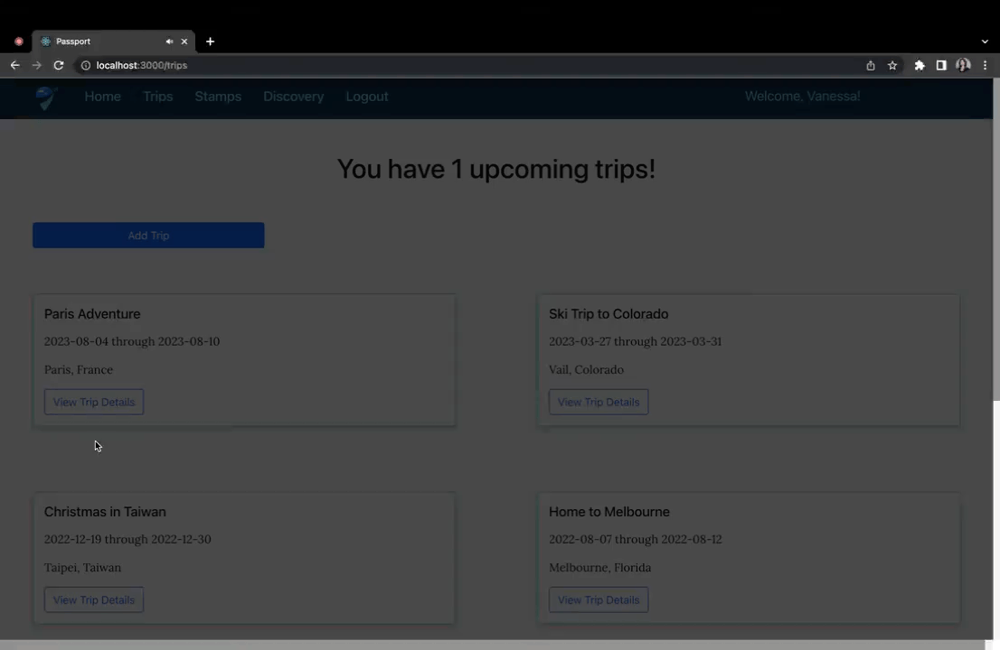

Passport
------


### Application Overview

Do you love to travel? Passport is meant for you! Passport is a full stack application designed for people who want to plan and document their trips.  Whether you're headed home for the holidays or headed to Munich for Oktoberfest, Passport is your partner in travel. 

### Features
- Users can create new trips and add itineraries, a packing list, and trip notes 
- Users can see an interactive map of all the places they visited during their travels
- Users can add Passport "stamps" (photos, journal entries, products) from their trips for lasting memories 
- Users can switch viewports without impacting their app experience through the use of responsive design
  
### User Experience

#### View Trips and Trip Details
------


#### View Itineraries and Itinerary Details
------


#### View Places Traveled Map and Stamps 
------


#### Create a New Stamp 
------


### Technologies Used

#### Backend Technologies


#### Frontend Technologies


In the planning stages, I used DB Diagram to create an entity relationship diagram and Miro to create a wireframe.  Both documents helped with solution design and were referenced throughout my work building out this app.  I also used a Github project board to create issues and manage work.

* [Passport ERD](https://dbdiagram.io/d/6406090c296d97641d85cc8e)

* [Passport Wireframe](https://miro.com/app/board/uXjVPhQbM4U=/?share_link_id=955298799066)

* [Passport Agile Project Board](https://github.com/users/vanessaspear/projects/1/views/1)
            
### Running the Application

**Required dependencies:** 
- Python
- Django
- React + React-DOM
- NPM
- Leaflet
- Bootstrap
- Pillow

Navigate to your workspace directory. 

Run the following command in terminal to setup the server:

```
git clone git@github.com:vanessaspear/passport-api.git
cd passport-api
python manage.py runserver
```

Seed the database: 
- Run the following commands in terminal
```
python3 manage.py makemigrations
python3 manage.py migrate
python3 manage.py loaddata users tokens types trips trip_reasons trip_notes stamp_photos reasons packing_list itinerary_categories itineraries categories
```

Run the following command in terminal to setup the client:

```
git clone git@github.com:vanessaspear/passport-client.git
cd passport-client
npm start
```

You should now be able to sign in to the application. 

To demo the app, register as a new user with an email and password or use the below login credentials.
```
username/email: jjones@travel.com
password: globetrotter
```

Author
------

Vanessa Spear 

[](https://github.com/vanessaspear)[](https://www.linkedin.com/in/vanessavspear/)
